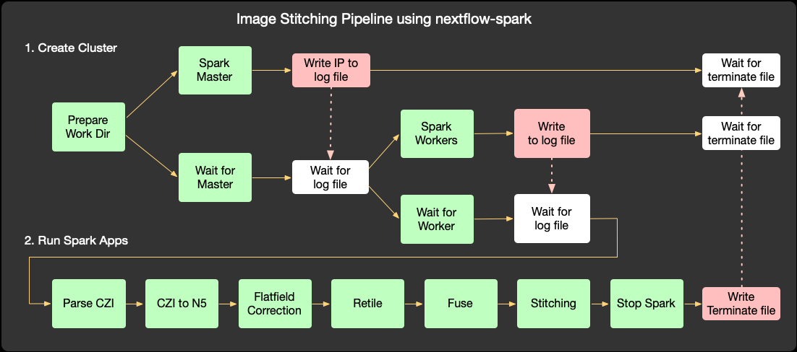

# Spark on Nextflow

This repo contains a reusable set of Nextflow subworkflows and processes which create transient Apache Spark clusters on any infrastructure where Nextflow runs. The only requirement is a shared filesystem which is accessible by all of the nodes that will be running the Spark processes.



In the above example, all of the green boxes represent Nextflow processes. We start a Spark cluster and run several Spark applications to process and stitch large bioimages. The resulting subworkflow can be included as a part of any Nextflow pipeline, and requires no special infrastructure for Spark.

We start by establishing a directory on shared storage that can be shared by all the Spark processes. We then start a long-running Spark master process, and a watcher which waits for the master to be ready by tailing its log file. Once the master is ready, we launch the workers, along with their own watchers. The watchers are key, because they return control to the Nextflow pipeline as soon as the Spark cluster is ready. Once the Spark cluster is running, we can submit applications to it as regular Nextflow processes which run as part of the workflow. When these Spark applications are finished, we write a termination file to a particular location on disk. The Spark master and worker tasks are watching for that file, and they terminate as soon as they see it.

## Usage

### Building a container

The provided container includes everything necessary to run Apache Spark. You can also extend this container to include your Spark Apps by creating a Dockerfile like this: 

```
FROM multifish/spark:3.0.1-hadoop3.2
COPY app.jar /app/app.jar
```

### Running 

You must have [Nextflow](https://www.nextflow.io) and [Singularity](https://sylabs.io) or [Docker](https://www.docker.com/) installed before running the pipeline.

To run a Spark application you need to specify a shared working directory that must be accessible to the nextflow app as well as to the master and all workers. If the application requires to access files that are not under the application startup directory, it must mount all directories it needs to access inside the Singularity or Docker container using `--runtime_opts` flag. If the Spark cluster is set up on an LSF grid, you can specify additional submit options using `--lsf_opts` flag. Typically you don't have to specify spark configuration but if there is an option using `--spark_conf` to specify a spark configuration directory that contains your own spark config files (similar to [example](examples/spark-conf) spark conf folder).

Here's an example to run the Color Depth Search application on an LSF with 4 workers, each worker having 4 slots. Each core has 15G of memory and the driver is started using client deployment mode using 1 core and 10G of memory. The Spark application parameters are passed as a string with all parameters enclosed within double quotes.

```
./main.nf -profile lsf \
        --runtime_opts "-e -B $PWD/local -B $PWD/examples -B /nrs/jacs/jacsData/filestore" \
        --lsf_opts "-P scicompsoft -W 30" \
        --workers 3 \
        --worker_cores 4 \
        --gb_per_core 15 \
        --driver_cores 1 \
        --driver_memory 10g \
        --spark_work_dir "$PWD/local" \
        --app $PWD/local/app.jar \
        --app_main org.janelia.colormipsearch.cmd.SparkMainEntry \
        --app_args \
        "searchFromJSON, \
        -m $PWD/local/testData/mask-2.json, \
        -i $PWD/local/testData/sgal4Targets.json, \
        --mirrorMask, \
        --maskThreshold 100, \
        --dataThreshold 100, \
        --xyShift 2, \
        --pctPositivePixels 2.0, \
        --pixColorFluctuation 2, \
        -od $PWD/local/testData/cdsresults.test"
```

The [examples](examples) folder contains more examples of how to run the application on a local cluster using Singularity or Docker.
